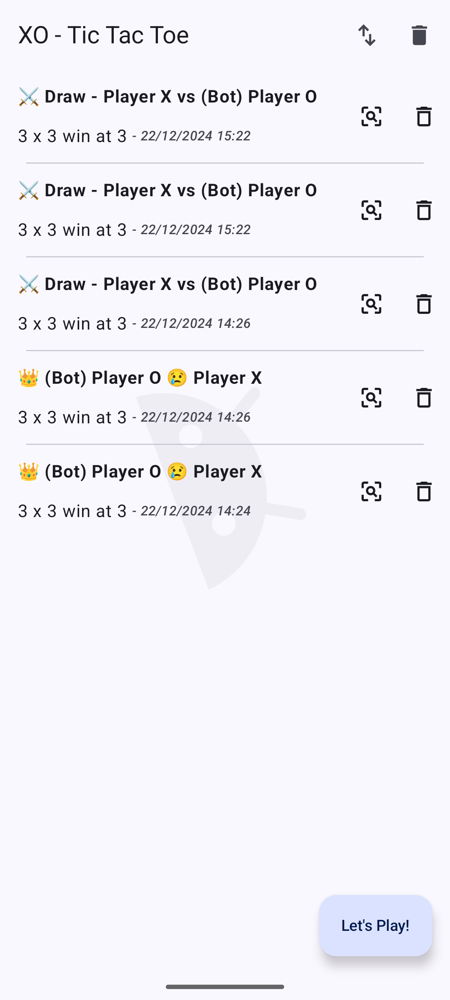
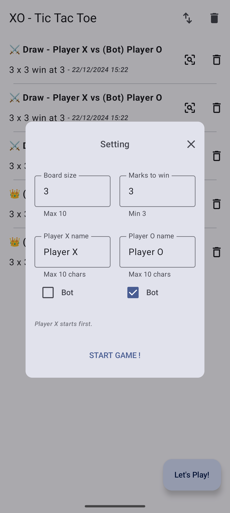
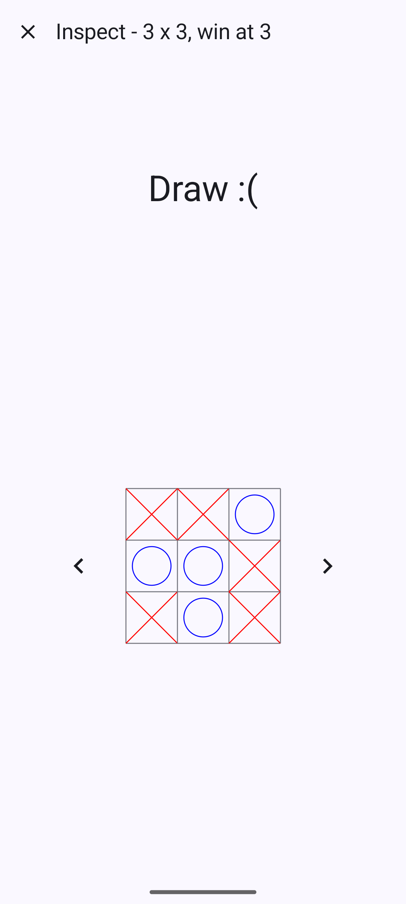
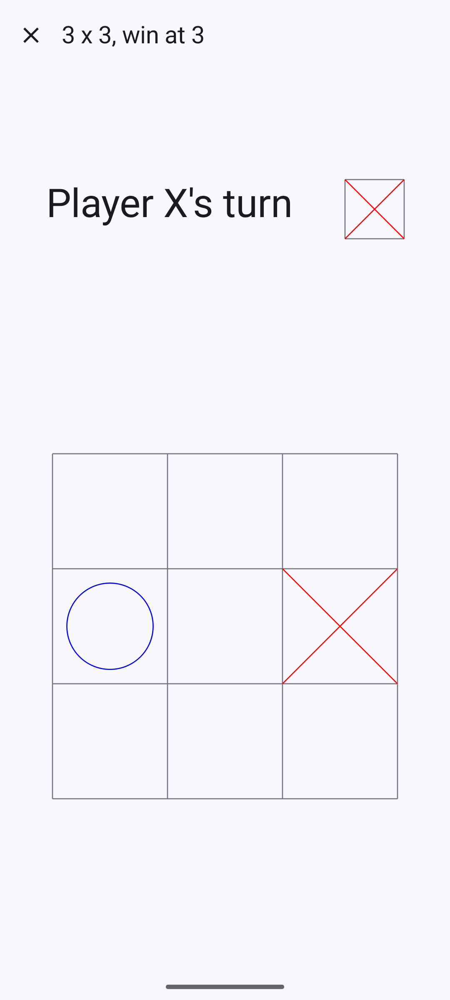
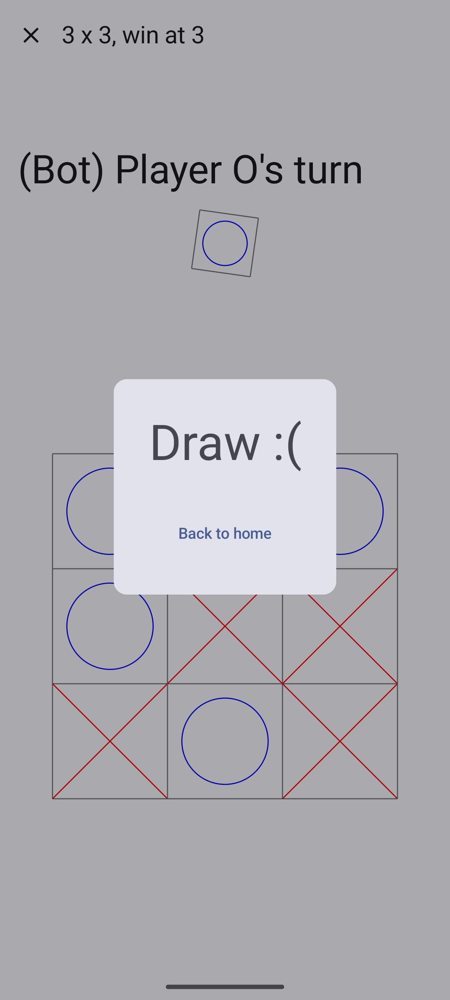

# XO

---

### Requirements
1. Use Kotlin and Jetpack libraries to build XO game with resizable board.
2. Can save and see replays.
3. Have AI bot.

### Features
1. XO (Tic Tac Toe) game for Android phones and tablets
2. 3x3 to 10x10 board size
3. Rewatchable gameplays
4. Fight with human or bot

### Table of Contents
1. [UI Design](#ui-design)
2. [App architecture](#app-architecture)
3. [Tic Tac Toe Algorithm](#tic-tac-toe-algorithm)
4. [How to build and run](#how-to-build-and-run)
5. [Future improvements](#future-improvements)


# UI Design

---

### Objective
- Minimal UI that's easy to test product's features.
- For fast prototyping, use UI components from Jetpack Compose that follows Material Design 3 guideline.

### Planning
From the requirements, there can be 3 pages in the app.
1. __PastGames__: Page that list past games.
    - Shows list of games with options to inspect or delete from storage.
    - This will be home page as the other two require extra steps to open.
    - As home page, it will have a button to start a new game too.
2. __Inspect__: Page that inspects a game.
    - To reduce workload, it should shares most UI elements with page Play.
      Only one key difference is that it will be able to scroll back and forth through game board snapshots.
3. __Play__: Page that plays a game.
    - Must-have features are playable board, current player indicator, and an alert to tell if the game has ended.

### Implementation result
|                             Past game screen                             |                                                 With play dialog                                                  |
|:------------------------------------------------------------------------:|:-----------------------------------------------------------------------------------------------------------------:|
|   |  |

|                          Inspect screen                          |                          Playing screen                          |                                    Playing result                                     |
|:----------------------------------------------------------------:|:----------------------------------------------------------------:|:-------------------------------------------------------------------------------------:|
|  |  |  |


### Additional UI features for better app navigation
- Splash screen: app feels smoother when launch
- Edge-to-edge: maximize display screen
- Filling empty space with some graphics: app doesn't feel empty


# App architecture

---

This app's code follows MVVM (Model-View-ViewModel) pattern.

```
   Pattern  |     Implementation     |    Responsibility
-----------------------------------------------------------
     View      Composeable functions      UI components
                        ⬇⬆
ViewModel       ViewModel instances       UI logic disregarding components
                        ⬇⬆
    Model           Repositories          Data abstraction
                  ⬇⬆         ⬇⬆
          Device storage    Network call  Data source
```
- ViewModel can also be used to pass data between screens as it survives configuration changes.
  So, there's no need to make navigation data serializable to put in a bundle.
- Jetpack Room library is used to access device's persistent storage (SQLite database).
- There is no network call in this app.
- Repository is declared and initialized at the application level (in ```Application``` class)
  so ViewModels will have use the same instance of data accessor (from Room database to Repository class) as the single source of truth.
- With MVVM, it's easy to track data flow in Android applications, making the code easy to maintain, fix, and extend.

### Implementation
#### Composable functions
```
Main screen
   |- Past Games screen (Default)
   |  |- Button to sort and delete all
   |  |- Game list items
   |  |  |- Inspect button
   |  |  |- Delete button
   |  |
   |  |- Play button showing a dialog with game option
   |     |- Board size, win condition, player and bot names, who goes first
   |
   |- Inspect screen
   |  |- Exit button
   |  |- Current player's name
   |  |- Game board and inspect buttons to move forward and backward
   |
   |- Playing screen
      |- Exit button
      |- Current player's name
      |- Game board
      |- Result dialog when game ends
```

> Simple ```when``` is used instead of ```NavHost``` because transition animation isn't required,
      and backstack is so small (max at 2) that using a function to handle back pressed is enough.

### ViewModels
Only one ```SharedViewModel``` is enough for passing data and access to local database.
It only passes its properties and methods, not the instance itself, to composable functions, i.e., all 3 screens.

### Repository
```XORepository``` gives access to ```XODatabase``` (SQLite database) which exposes certain read & write functions through its DAOs (Data Access Objects).

__Database entities__

|                                   Game |
|---------------------------------------:|
|                           🔑 id (UUID) |
|                        boardSize (Int) |
|                     winCondition (Int) |
|                       playerX (String) |
|                       playerO (String) |
|  moves (List of 2D matrices as String) |
|                      timestamp: (Long) |


# Tic Tac Toe Algorithm

---

### Techniques used
- Minimax with alpha-beta pruning
- Reduce search tree breadth
- Reduce search tree depth

### Minimax
This algorithm is used because it treats Tic Tac Toe as decision tree
and tries to find the move with the highest score for the bot.

Minimax function is called recursively while passing the opponent (of the player that call the function) as argument after making a move.
The player (bot) that we want to win is call maximizer. A maximizer get the best move from the maximized score.
A termination of the recursive function happens only when the game ends, i.e., win, lose, or draw.
It then returns the score based on the player being a maximizer or not, e.g., +1 for maximizer's winning and -1 for losing.
With these rules, minimax simulates the back and forth play of a Tic Tac Toe game.
In addition, adding depth as score penalty makes the algorithm choose the move that wins fast.

### Alpha-Beta Pruning
As board gets bigger, minimax will have more moves to compute, making it a lot slower for only a small increase in board size.
The pruning technique helps reduce the number of tree nodes while searching.
It keeps track of the best scores from maximizer and minimizer, starting at each level and the next level down the search tree.
When there's no improvement in favor of the maximizer, the search in that tree branch stops. This makes the algorithm faster,

### Reduce search tree breadth
An increase in board size still makes alpha-beta pruning slower, as 10x10 is the largest board in the game.
Adding some rules to limit search tree breadth will help. In this game, it is done by limiting available moves the minimax algorithm have to check.
The idea is that players should play around their opponent's marks. But this rule makes the bot become less aggressive, i.e., never play far from player's marks.
To make it more aggressive, we can randomly add a number of moves to the mix, thus increase the chance of finding a better move that's not just about blocking the opponent.

### Reduce search tree depth
Setting maximum search depth at each tree depth can help.
With the maximum depth as the number of available moves, we can add rules to decrease that depending on available moves and other board properties, like board size.
For this game, there are 3 elements in consideration; total cells on board (```boardSize * boardSize```), and unfiltered and filtered available moves.
As total cells increases, the depth should increase too, but at most at that value.
However, because the maximum depth at that value will make the program slow, it should be reduced by the available moves.
```
max depth = board size * board size / Max(1, unfiltered available moves)
```
But as the search goes deeper, this max depth will reach 1, which is bad for the algorithm.
This is fixed by adding some value that still makes the search effective.
```
max depth = 2 + board size * board size / Max(1, unfiltered available moves)
```
But this can exceeds the number of filtered available moves.
So, it should be capped at a multiplier of that.

> Use multiplier constant because
> - Number of filtered moves can be much less than unfiltered moves.
> - With small number of marks on the board, it shouldn't matter. Therefore, small increase at early game is fine.

```
max depth = Min(2 * unfiltered moves, 2 + board size * board size / Max(1, unfiltered available moves))
```


# How to build and run

---

1. Tool version requirements
   - Android Studio : Koala | 2024.1.1 Patch 1
   - Gradle : 8.7
   - Kotlin : 1.9.23
   - JDK : 17
   > Although there is no problem during the development, from
   > [Android Studio to AGP version mapping](https://developer.android.com/build/releases/gradle-plugin#android_gradle_plugin_and_android_studio_compatibility)
   > and [Java Kotlin Gradle compatibility matrix](https://docs.gradle.org/current/userguide/compatibility.html),
   > some features of the tools may have compatibility issues.

2. Set up emulator in Android Studio
   - Use ```Resizable (Experimental) API 34```

3. Clone this project and run in Android Studio


# Future improvements
- Design and polish UI in Figma before implementing in code.
- Bot should have more than one difficulty.
- Online play with strangers.
